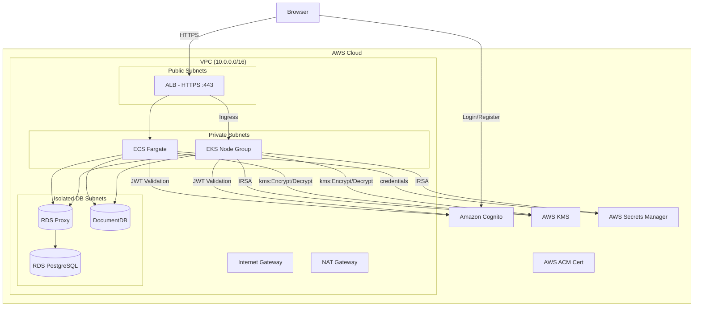

# Checklist: Secure Multi-Orchestration App with DB Persistence & Encryption

Use this checklist to track your progress as you deploy a highly secure, multi-database application using AWS ECS and EKS. This architecture features IAM Roles for Service Accounts (IRSA), KMS data encryption, Cognito authentication, Secrets Manager, and HTTPS/TLS integration.

## Flowchart

## Phase 1: AWS Infrastructure Provisioning (Monolithic Terraform)
- [ ] Configure `providers.tf` with the standard AWS provider and an S3 remote backend block.
- [ ] **Network:** Provision 2 Public, 2 Private, and 2 Isolated DB Subnets, plus 1 IGW and 1 NAT Gateway in `vpc.tf`.
- [ ] **Databases:** Provision Amazon RDS, an RDS Proxy, and an Amazon DocumentDB cluster in `databases.tf`.
- [ ] **Security (Auth & Secrets):** Provision an AWS Secrets Manager secret for the DB credentials and an Amazon Cognito User Pool/Client in `security.tf`.
- [ ] **Security (Encryption & TLS):** Provision an AWS KMS Symmetric Key and generate a self-signed TLS Certificate using the `tls` provider, imported into AWS ACM.
- [ ] **ECS Target:** Provision the ECS Cluster, Fargate tasks, an ALB with an HTTPS listener (port 443) attached to the ACM certificate, and ensure ECS Task Execution Roles have KMS and Secrets Manager permissions.
- [ ] **EKS Target:** Provision the EKS Cluster and Node Groups, explicitly disabling Auto Mode.
- [ ] **EKS Security:** Configure IRSA (IAM Roles for Service Accounts) by creating an IAM Role with `kms:Encrypt/Decrypt` and `secretsmanager:GetSecretValue` permissions tied to your cluster's OIDC provider.
- [ ] Execute `terraform init`, `terraform plan`, and `terraform apply` to provision the environment.

## Phase 2: Application Development & Security Integration
- [ ] **Backend Secrets:** Update the Go application to fetch database credentials from AWS Secrets Manager on startup instead of relying on environment variables.
- [ ] **Backend Authentication:** Implement Go middleware to validate Amazon Cognito JWT Bearer tokens on protected API routes.
- [ ] **Backend Encryption:** Integrate the AWS KMS SDK to encrypt unstructured student notes before saving them to DocumentDB, and decrypt them upon retrieval.
- [ ] **Frontend Authentication:** Build React Router `/login` and `/register` pages interacting with the Amazon Cognito User Pool.
- [ ] **Frontend API Calls:** Ensure the React frontend attaches the Cognito Access Token as an `Authorization: Bearer <token>` header for all authenticated requests.

## Phase 3: Kubernetes Security & Deployment Lifecycle (EKS)
- [ ] Update your local kubeconfig via the AWS CLI to connect to the EKS cluster.
- [ ] **Ingress Controller:** Deploy the AWS Load Balancer Controller to your EKS cluster to enable ALB provisioning via Kubernetes Ingress.
- [ ] **Service Accounts:** Define a Kubernetes `ServiceAccount` in your manifests annotated with the ARN of your newly created IRSA IAM Role.
- [ ] **Deploy App Layers:** Apply `k8s/backend.yaml` (using the new ServiceAccount) and `k8s/frontend.yaml` to the cluster.
- [ ] **Deploy Ingress:** Apply `k8s/ingress.yaml` configured with annotations to use the ACM Certificate ARN and listen for HTTPS traffic.
- [ ] Verify that navigating to your Load Balancer's DNS over `https://` securely loads the application and that the Cognito auth flow works.

## Phase 4: Infrastructure Code Refactoring (Modularization)
- [ ] Deconstruct the monolithic Terraform setup into dedicated `modules/vpc`, `modules/databases`, `modules/security`, `modules/ecs`, and `modules/eks` directories.
- [ ] Declare explicit input parameters (`variables.tf`) and structured return schemas (`outputs.tf`) for each module.
- [ ] Refactor the root `main.tf` to invoke all modules cleanly, securely passing ARNs (KMS, ACM, Secrets) and DB endpoints between the modules.
- [ ] Execute `terraform init` and `terraform apply` to validate zero configuration drift.
